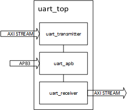

# UART16550

## 概要

uart_top 模块是一个支持 APB 总线接口的 UART 通信接口，包含 UART 发送器和接收器，使用 AXI Stream (AXIS) 接口进行数据传输，同时提供 GPIO 功能和状态信号。

## 支持特性

1. 可配置的波特率

2. 发送接收计数

3. axi-stream 数据接口

4. apb3 寄存器接口

5. 可配置的 5-8 位数据位

6. 可配置的 1.5-2 位停止位

7. 可选的奇校验/偶校验/固定校验/无校验位

8. 可选的输出使能/输出时钟

## 功能框图

## 寄存器定义

| 寄存器            | 地址 | 读写 | 说明                             |
| ----------------- | ---- | ---- | -------------------------------- |
| CTRL              | 0x00 | RW   | 控制寄存器                       |
| STATUS            | 0x04 | RW   | 状态寄存器                       |
| BAUD_FREQ         | 0x08 | RW   | 波特率配置寄存器                 |
| BAUD_LIMIT        | 0x0C | RW   | 波特率配置寄存器                 |
| TX_CNT            | 0x10 | RO   | 发送计数寄存器                   |
| RX_CNT            | 0x14 | RO   | 接收计数寄存器                   |
| RX_OVERFLOW_CNT   | 0x18 | RO   | 接收数据溢出计数寄存器           |
| GPOE              | 0x1C | WR   | 通用输出使能                     |
| GPO               | 0x20 | W/R  | 通用输入输出寄存器               |
| GPI               | 0x24 | W/R  | 通用输入输出寄存器               |
| ADDR_OE_WAIT_TIME | 0x28 | W/R  | 数据输出开始前 OE 等待时间寄存器 |
| ADDR_OE_HOLD_TIME | 0x2C | W/R  | 数据输出结束后 OE 保持时间寄存器 |

_see the sources code for detail_

### 控制寄存器

| bit  | 31       | 30:16 | 15       | 14    | 13         | 12       | 11        | 10        | 9:8       | 7:4  | 3          | 2          | 1     | 0     |
| ---- | -------- | ----- | -------- | ----- | ---------- | -------- | --------- | --------- | --------- | ---- | ---------- | ---------- | ----- | ----- |
| desc | soft_rst | resv  | loopback | break | fix_parity | even_odd | parity_en | stop_bits | data_bits | resv | rx_cnt_clr | tx_cnt_clr | rx_en | tx_en |

### 状态寄存器

| bit  | 31:8 | 7            | 6             | 5            | 4       | 3:1  | 0       |
| ---- | ---- | ------------ | ------------- | ------------ | ------- | ---- | ------- |
| desc | resv | rx_frame_err | rx_parity_err | rx_break_err | rx_busy | resv | tx_busy |

### 波特率配置寄存器

计算方法如下：

clk = 72e6;

ovsr = 8;

baud_rate = 9600;

temp = gcd(fclk , ovsr \* baud_rate);

baud \* freq = ovsr \* baud \* rate / temp;

baud_limit = fclk / temp - baud_freq;

### 发送/接收/接收溢出计数寄存器

对发送、接收、接收到数据但 axi-stream 下游未就绪的数据字节进行计数

### 通用输出控制寄存器

控制通用输入输出的输出使能

### 通用输入输出寄存器

写时为写通用输出寄存器

读时为读通用输入寄存器
